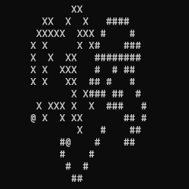

# Program: Symulacja zachowania mrówki Langtona

## Badane Zjawisko
Mrówka Langtona to automat komórkowy dzia³aj¹cy wed³ug nastêpuj¹cych zasad:
1. Mrówka porusza siê po planszy zmieniaj¹c stan komórek.
2. Plansza ma okreœony wymiar, ale nie posiada krawêdzi - zapêtla siê.
3. Gdy trafia na komórkê o stanie 0, nadaje jej okreœlony stan ró¿ny od 0, obraca siê w lewo i przenosi na kolejn¹ komórkê.
4. Gdy trafia na komórkê o stanie ró¿nym od 0, nadaje zeruje j¹, obraca siê w prawo i przenosi na kolejn¹ komórkê.

## Opis Programu
Program ma na celu symulacjê zachowania mrówek Langtona na planszy, gdy¿ ich zachowanie mo¿e byæ trudne do przewidzenia przy wiêkszej iloœci kroków.

### Przyk³adowe wyniki pracy programu
 

### Wartoœci zwracane przez program
- 0, gdy wszystko wykonane jest poprawnie.
- -1, gdy nast¹pi b³¹d otwarcia pliku config.txt.
- -2, gdy wyst¹pi b³¹d alokacji pamiêci.
- -3, gdy deklaracja mrówki wystêpuje przed iloœci¹ (pamiêæ jest niezaalokowana).
- -4, gdy iloœæ mrówek nie zawiera siê w dozwolonym zakresie.
- -5, gdy jedna z zadeklarowanych mrówek wychodzi swoim numerem poza zakres.
- -6, gdy jedna z mrówek posiada niedozwolony symbol.
- -7, gdy dane w pliku konfiguracyjnym s¹ niewystarczaj¹ce do uruchomienia symulacji.
- -8, gdy nast¹pi b³¹d utworzenia pliku GIF.

Komunikaty o b³êdach oraz o wczytanych danych wysy³ane s¹ do strumienia b³êdów.
Aby odczytaæ je podczas uruchamiania programu z wizualizacj¹ w konsoli, nale¿y przyk³adowo przekierowaæ ten strumieñ do pliku.  
W systemie Linux mo¿na to zrobiæ przy pomocy nastêpuj¹cej komendy:  
`./program 2> log.txt`

## Kompilacja
Aby skompilowaæ program nale¿y do³¹czyæ biblioteki PF_cells.c oraz gifenc.c.  
Przyk³adowa komenda do kompilacji przy pomocy kompilatora GCC:  
`gcc -Wall -Wextra main.c PF_cells.c gifenc.c -o program`

## Konfiguracja
Program konfigurowany jest przez edycjê pliku config.txt, który powinien znajdowaæ siê w tym samym folderze, co program.
### Sk³adnia
#### Zasady
1. Nazwy parametrów musz¹ zaczynaæ siê od pocz¹tku linii, nie mo¿e przed nimi staæ ¿aden inny znak.
2. Nazwê parametru od jego wartoœci oddziela znak '=', bez spacji przed ani po.
3. Dla argumentów, które potrzebuj¹ wiêcej ni¿ jedn¹ wartoœæ, poszczególne wartoœæi oddzielane s¹ przecinkiem.
4. Nierozpoznane argumenty s¹ ignorowane.
5. Mo¿na umieszczaæ komentarze u¿ywaj¹c znaku '#' na pocz¹tku linii.
6. Deklaracja parametru 'ants' musi wyst¹piæ przed jakimkolwiek parametrem mrówek.
#### Wzory
1. [parametr globalny]=[wartoϾ]
2. [parametr mrówki][nr mrówki]=[warrtoœæ]
3. #[komentarz]
## Parametry
### Globalne
output=[c/f] - okreœla sposób przedstawienia dzia³ania, 'c' wyœwietla wynik w konsoli w czasie rzeczywistym, 'f' zapisuje do pliku we formacie GIF;  
size=[szerokoœæ],[wysokoœæ] - okreœla rozmiar planszy w komórkach, 1 komórka <=> 1 symbol <=> 1 piksel, max 65,535 (wiêksze wartoœci zostan¹ odczytane nieprawid³owo);  
steps=[iloœæ] - okreœla iloœæ kroków, które maj¹ zostaæ wykonane;  
delay=[liczba ca³kowita] - okreœla czas wyœwietlania klatki w gifie, w setnych sekundy;
ants=[iloœæ] - okreœla iloœæ mrówek, min 1, max 9;
### Mrówki
inipos[nr]=[szerokoœæ],[wysokoœæ] - okreœla pocz¹tkowe po³o¿enie mrówki na planszy;  
face[nr]=[N/E/S/W] - okreœla pocz¹tkowy kierunek, w który mrówka jest zwrócona;  
symbol[nr]=[symbol ASCII, widoczny(nie bia³y znak), nie '@' (symbol zarezerwowany dla pozycji mrówki)] - okreœla symbol pozostawiany przez mrówkê w reprezentacji w konsoli;  
color[nr]=[red/green/blue/cyan/magenta/yellow] - okreœla kolor pozostawiany przez mrówkê w pliku GIF;

## U¿yte biblioteki:
GIF encoder - open source  
https://github.com/lecram/gifenc  
  
PF Cells - Stworzona przeze mnie na potrzeby projektu w celu poprawienia przejrzystoœci kodu.  